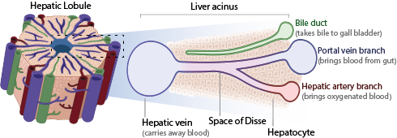
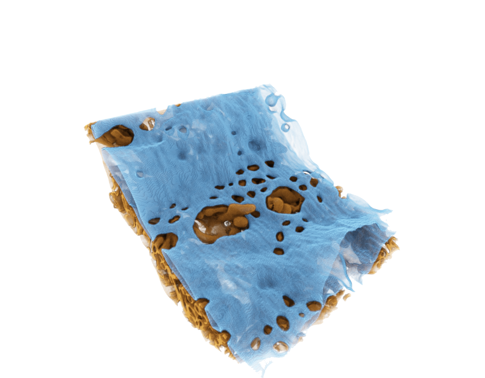

Portal venous and hepatic arterial blood enters the liver and flows through hepatic sinusoids to the hepatic vein (also known as the central vein) which returns blood to the heart. The sinusoids are capillary-like structures between which are situated rows of hepatocytes. Sinusoidal blood is separated from hepatocytes by hepatic endothelial cells which form the capillary-like structure. Between hepatic endothelial cells and hepatocytes is a space (Space of Disse1) which does not contain circulating cellular elements.

Hepatic endothelia cells (blue cells in rendering) do not form a basement membrane. However, these cells have a unique feature. Each endothelial cell has up to 100 fenestra (holes) which are arranged in a sieve- like pattern. This feature is unique to hepatic endothelial cells. In effect, they are the only cells in the body which has  cytoplasm resembling Swiss cheese! The holes average ~120 nm diameter and their number and size varies along the length of individual sinusoids2.

The fenestrae were first seen by Wisse using TEM and SEM3. Because they resembled kitchen sieves, it was proposed that they have a sieve-like function keeping vascular cellular elements distant from hepatocytes and, at the same time, permitting bidirectional flow of nutrients, drugs, hormones and other small molecule between the system circulation and hepatocytes. Fenestrae are essential for these critical physiologic processes.

Fenestrae also have dynamic features. Histochemical studies revealed that fenestrae have an actin ring associated with myosin 2 and an ability to contract upon stimulation with calcium, serotonin and other agonists4,5.

Explore the fenestra in a FIB-SEM image volume of mouse liver [here](https://tinyurl.com/mvzvdbnh). A rendering of this location is shown in the above image with the hepatic endothelia cell (blue) and hepatocyte (gold) separated for visual clarity.

## Challenging questions are:
1.	How and where do fenestrae form?
2.	What is their function? Are they important in development, adaptation to metabolic stress, neoplasia and the mobilization of hepatocyte function when needed?
3.	Can fenestra function be pharmacologically modified for therapeutic purposes?
4.	Does impaired fenestral structure contribute to chronic liver disease?

## References
1. Sanz-García C, Fernández-Iglesias A, Gracia-Sancho J, Arráez-Aybar LA, Nevzorova YA, Cubero FJ. The Space of Disse: The Liver Hub in Health and Disease. Livers. 2021; 1(1):3-26. [DOI: 10.3390/livers1010002](https://doi.org/10.3390/livers1010002)
2. Gatmaitan, Z and Arias, IM: Hepatic Endothelial Cell Fenestrae.  In: Cells of the Hepatic Sinusoid, Vol. 4.  Wisse, E, Knook, DL and Decker, K, eds.  The Kupffer Cell Foundation, The Netherlands  1993.
3. Wisse E, An electron microscopic study of the fenestrated endothelial lining of rat liver sinusoids, Journal of Ultrastructure Research, Vol 31, Issues 1–2, 1970, [DOI: 10.1016/S0022-5320(70)90150-4](/https://doi.org/10.1016/S0022-5320(70)90150-4).
4. Gatmaitan Z, Varticovski L, Ling L, Mikkelsen R, Steffan AM, Arias IM. Studies on fenestral contraction in rat liver endothelial cells in culture. Am J Pathol. 1996;148(6):2027-41. [PMCID: PMC1861643](https://www.ncbi.nlm.nih.gov/pmc/articles/PMC1861643/pdf/amjpathol00042-0301.pdf)
5. Braet F, De Zanger R, Baekeland M, Crabbé E, Van Der Smissen P, Wisse E. Structure and dynamics of the fenestrae-associated cytoskeleton of rat liver sinusoidal endothelial cells. Hepatology. 1995 (1):180-9.
[DOI: 10.1002/hep.1840210130](https://doi.org/10.1002/hep.1840210130)
